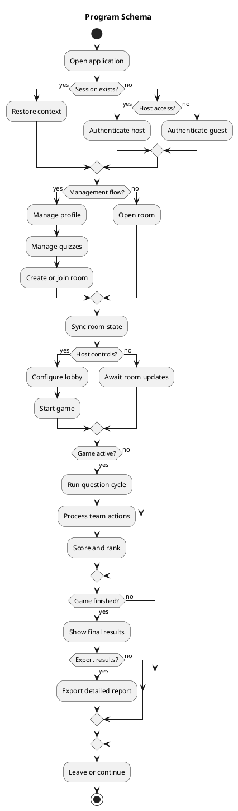

# Program Schema

High-level ISO 5807-oriented schema in PlantUML.

Constraints applied:
- high abstraction level
- maximum 20 blocks
- maximum 5 words per block

PlantUML mapping:
- `start` / `stop` -> terminal
- `:...;` -> process or input/output
- `if / else / endif` -> decision

